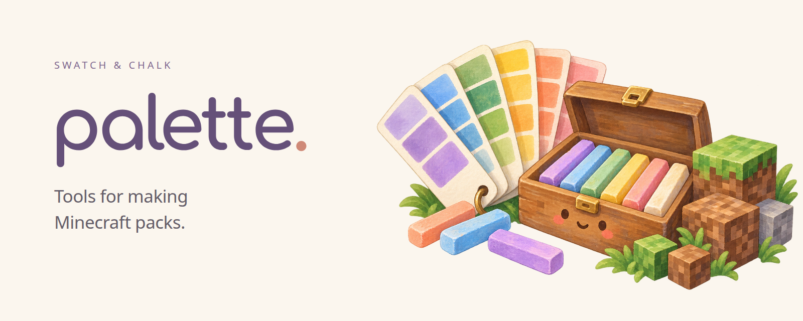

<p align="center">
  
</p>

<p align="center">
  <a href="https://github.com/iamkaf/palette/releases">Downloads</a> ·
  <a href="swatch#readme">Swatch guide</a> ·
  <a href="chalk#readme">Chalk guide</a> ·
  <a href="https://github.com/iamkaf/palette/issues">Help &amp; ideas</a>
</p>

Palette is a small collection of command-line tools for making Minecraft packs. Use
**Swatch** to put together a modpack with exact versions and separate client and server
files. Use **Chalk** to write a datapack once, handle differences between Minecraft
versions, and check it in the game.

Each tool works on its own. Pick the one your pack needs.

## 🎨 Swatch · modpacks

Choose your mods, resource packs, datapacks, and shaders in `pack.toml`. Swatch records
their exact downloads and hashes in `pack.lock.toml`, along with the files you authored.
It then builds client and server archives from those locked inputs.

- Keep shared, client-only, and server-only content in the right places.
- Stage ordinary Minecraft folders for a launcher or test tool to use.
- Prepare a release, verify its files, and publish those same files to your configured
  destinations.

```bash
swatch install       # lock your pack's inputs and download its dependencies
swatch build all     # build client and server archives
swatch stage all     # make client and server folders for local use
```

Run these inside a pack repository. The [Swatch guide](swatch#readme) walks through
creating one with `swatch init`, adding content, and publishing a release.

## 🖍️ Chalk · datapacks

Write your datapack for the newest Minecraft version you support. If an older version
needs a different file, place it beside the original with a version range in its name:

```text
data/my_pack/tags/block/frame.json          # newest version
data/my_pack/tags/block/frame@-26.2.json     # Minecraft 26.2 and older
```

Chalk turns those variants into one zip with the right overlays and `pack.mcmeta`.
It can also load the pack in a vanilla server on each supported version and point game
errors back to the file that caused them.

```bash
chalk check          # validate the pack and load it in supported game versions
chalk dev            # play the pack and reload it every time you save
chalk test           # run your pack's in-game tests
chalk build          # write the zip to build/chalk/
```

Run these inside a pack repository with `chalk.toml` and a `datapack/` directory.
See the [Chalk guide](chalk#readme) for the layout, supported versions, and test setup.
Game checks need Java and [Modstage](https://github.com/iamkaf/modstage); tests also
need the setup described in the guide.

## Get the tools

Download a prebuilt **Swatch** binary for Linux, macOS, or Windows from
[GitHub Releases](https://github.com/iamkaf/palette/releases). Extract the archive and
put the executable on your `PATH`.

Swatch and Chalk have separate versions. Release tags use the tool's name, such as
`swatch-v0.5.0`. Each native release includes a hash manifest, a Sigstore bundle, and
GitHub artifact attestations.

**Chalk** can currently be built from source. From this repository's root, with stable
Rust installed:

```bash
cargo build --release --locked -p chalk
./target/release/chalk --help
```

Use `-p swatch` to build Swatch instead. On Windows, the executable ends in `.exe`.

Both tools are young. Swatch's manifest, lockfile, and release formats are experimental;
Chalk's layout and commands may change as more packs use it.

## Inside Palette

| Directory | What lives there |
| --- | --- |
| [`swatch/`](swatch) | Modpack authoring, locking, staging, builds, and publishing. |
| [`chalk/`](chalk) | Datapack variants, builds, game checks, and tests. |
| [`publish/`](publish) | The shared publishing library for GitHub Releases, Maven, Modrinth, and CurseForge. |

The publishing library is currently used by Swatch.

To check the Rust workspace:

```bash
cargo fmt --all -- --check
cargo clippy --workspace --locked --all-targets -- -D warnings
cargo test --workspace --locked
```

## Help & license

[Open an issue](https://github.com/iamkaf/palette/issues) for bugs, setup questions, or
ideas. For suspected vulnerabilities, use the [security policy](SECURITY.md).

Palette is licensed under [Apache 2.0](LICENSE).
